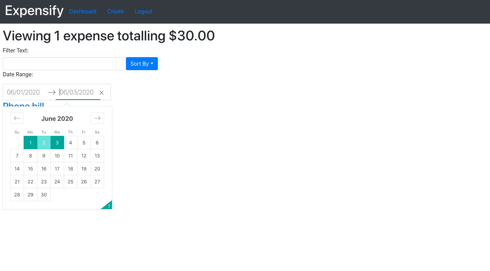

# Expensify Application

## Sort your expenses

First time using Firebase and Bootstrap

- Some notes within files as this was a learning exercise for me and I'd like some reference notes, as well as the playground file.

### Tech

- React
- React Redux
- Enzyme
- React Bootstrap
- Styled/Emotion
- Firebase

### Commands

- `npm install` - installs all applications dependencies
- `npm start` - locally loads application
- `npm test` - runs applications tests

# Screenshots

## Login Page

Login via Firebase authentication using a google account

## Add Expense Page

Create a brand new expense with a description, amount, due date and optional note

## Dashboard Page (With Expenses)

Display all expenses that match sorting rules

## Edit Expense Page

Edit existing expense to update saved data (description, amount, due date or note) or remove/delete the expense from your account

## Sort By Text Example

Sort all saved expenses by text input, app re-renders as you type

## Sort By Date Example

Sort all saved expenses by due dates

## Firebase Data

Showing how data is saved within the application and restricted to each user

## Firebase Rules

Who can read/write to the application and how the incoming data is validated by Firebase

- Based on Udemy tutorial by Andrew Mead
